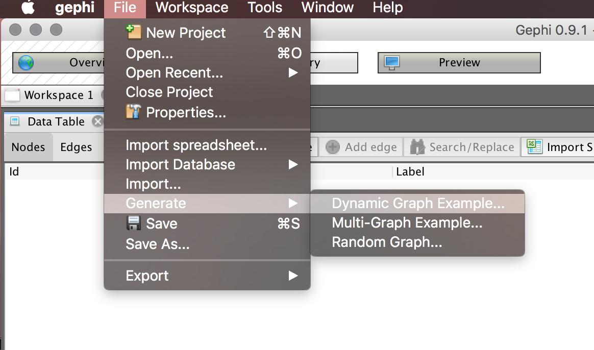

## Spatial Networks

To make spatial networks, Gephi needs the **GeoLayout** plugin and your node attributes must include columns for latitude and longitude coordinates.

Download these datasets, courtesey of Martin Grandjean: [nodes table](data/Nodes1.csv) and [edges table](data/Edges1.csv). Note that Grandjean's data is separated by a semicolon. You'll need to select the semicolon as the column separator in the CSV during import. **Be sure to import the nodes table first.**


On the next screen, we need to tell Gephi that our latitude and longitude columns are **double**, not **integer**. 


Once the nodes are imported, import the edges table.


On the next screen, be sure to uncheck "Create missing nodes."


## Dynamic Networks

<p style="font-size: 1.5em; text-align: center; color: #c0392b;">
The dynamic networks feature may be unstable, especially for very large networks. Save your work often.
</p>

As historians, our networks may not always exist as a consistent entity. They may, in other words, change over time, and we may want to explore how a network changes. Gephi provides a way for exploring a network's timeline.

Note that we can refer to two types of dynamics when it comes to networks:

1. **Dynamic topology** refers to nodes and edges that can change position, or appear and/or disappear through time. 
2. **Dynamic attributes** refers to nodes, edges, and labels that might change in size and color through time, reflecting changes in the value of attributes in the data.

### Generating a Dynamic Network

We're going to use Gephi's built-in dynamic network generator to play around with this feature. Under `File`, select `Generate`, and select `Dynamic Graph Example...`. Once the network loads, you'll see a new toolbar along the bottom of Gephi to allow you to enable the timeline. Select that button and you'll be presented with the timeline with the entire timeframe selected by default. 



Our default timeline selects the full span of time available in the dataset. 


We can narrow our selection to a span of time we'd like to investigate.


You can then animate your network, either by clicking and dragging the selection box or by clicking the Play button to the left of the timeline.

While this basic animation is great, it gets better: we can run layouts while the timeline is running; perform ranking operations to change color, size, edges, or labels according to changes in attributes; and we can turn on filters while the timeline is running. For these to work in your network, you will need to toggle the Auto Apply appearance button to allow nodes to change dynamically in size, color, or position.


### Gephi and Dynamic Data

Gephi offers two formats for dynamic data: *timestamp* and *interval*.

#### Timestamps

*Timestamps* allow you to define exact times in a node or edge. In your data, time stamps are formatted as:

```
<[time1, time2, time4]>
```

This would indicate to the network that network elements exist  at times 1, 2, and 4.

Timestamped data can also contain values to indicate the attribute of a node or edge at a given moment. They can be formatted as:

```
<[time1, value1]; [time2, value2]; [time4, value4]>
```

For each case above, each *time* element had a particular value at that moment. 

#### Interval

*Interval* allows you to identify elements that exists over periods of time. They are indicated as:

```
<[time1, time3, value1]; [time4, time9, value2]>
```

The above indicates that an element had a `value` from time 1 through 3, and another value from time 4 through 9. If we used a paretheses instead of a square closing bracket, we can indicate an open interval (for example, `[time1, time5)` means the interval goes up to but does not include *time5*).


At the moment, there is no way to export the animation of the network. If you need an animation to share, you'll have to capture a screen recording of the network that you can then share.

## Next steps

Individually or in groups, create your own network visualization.

1.  Select another sample dataset from Gephi, [download one of their samples](https://github.com/gephi/gephi/wiki/Datasets), or load in your own network data.
2. Try running some of the network statistics on the network. Select a few different ones, examine what they're doing to the network data and what the results are inferring. What do these various measures tell you about your network?
3.  Once you have some network measures ready, try adjusting the visuals in the network---node size and color, edge colors and weights, layouts, and so on. 
4.  Output your network as a PDF or PNG. We'll come back together, time permitting, to talk about your results.
5.  Examine some of the [plugins for Gephi](https://marketplace.gephi.org/plugins/). You can, for example, embed latitude and longitude data for nodes and [geographically layout the network](https://marketplace.gephi.org/plugin/geolayout/). There are [many possible layout options](https://marketplace.gephi.org/plugin_categories/plugin-layout/). 
