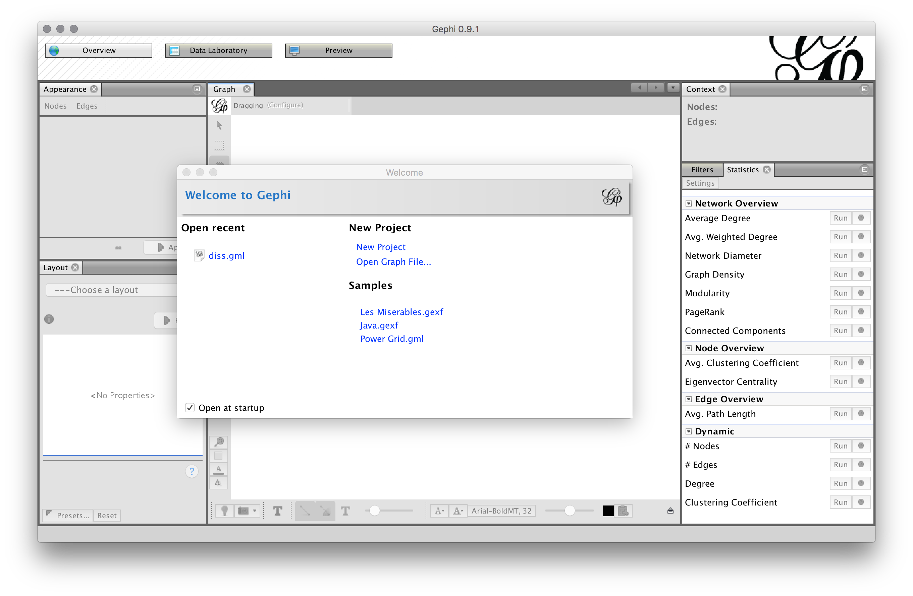
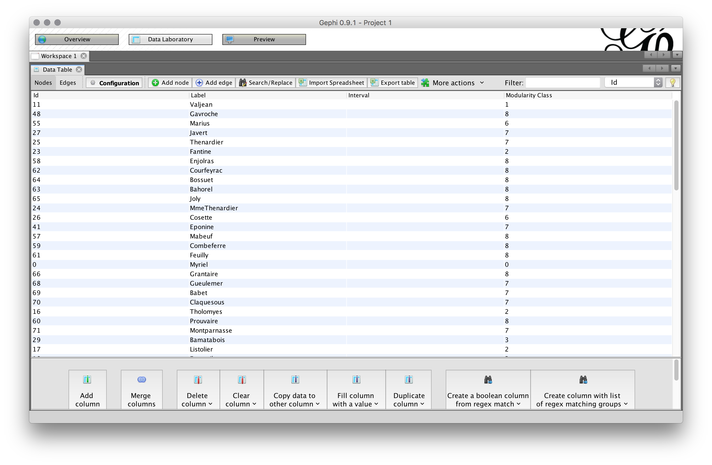
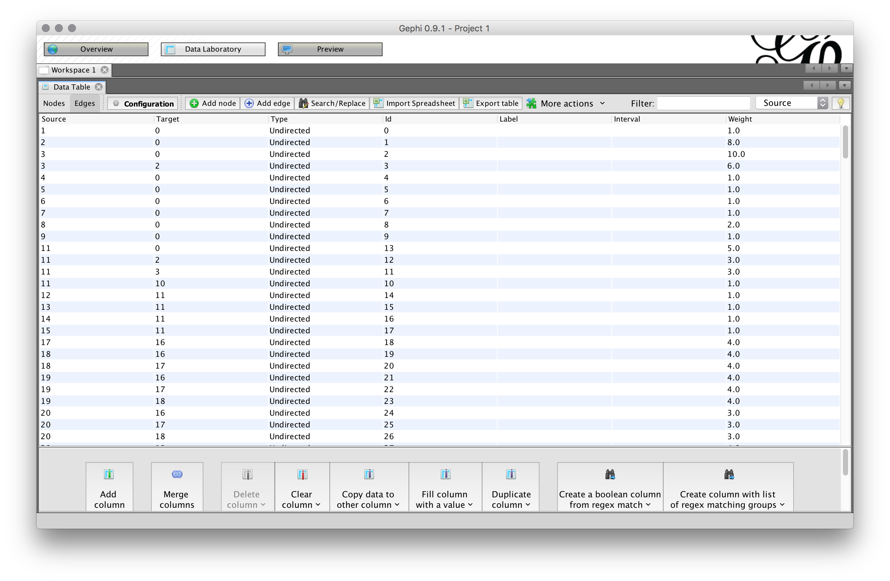
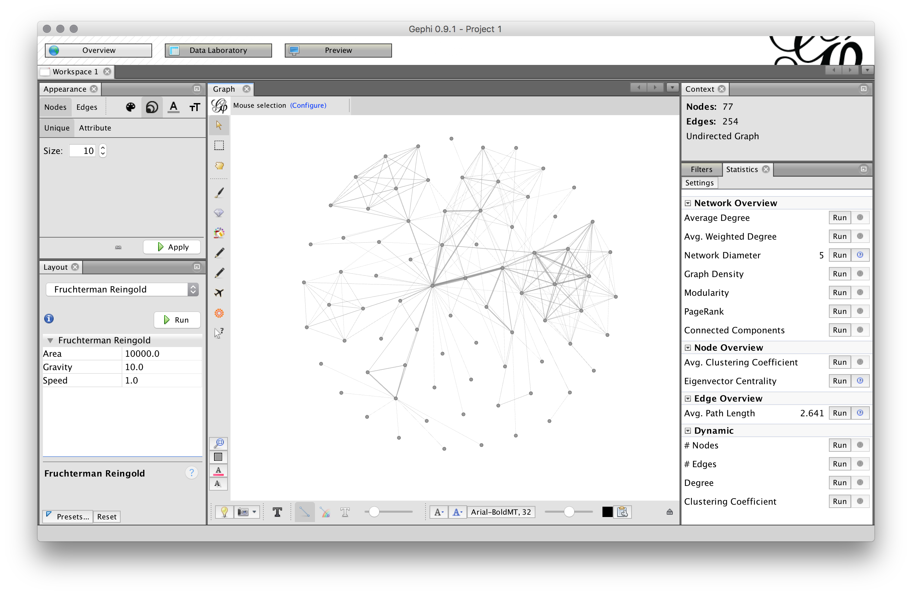
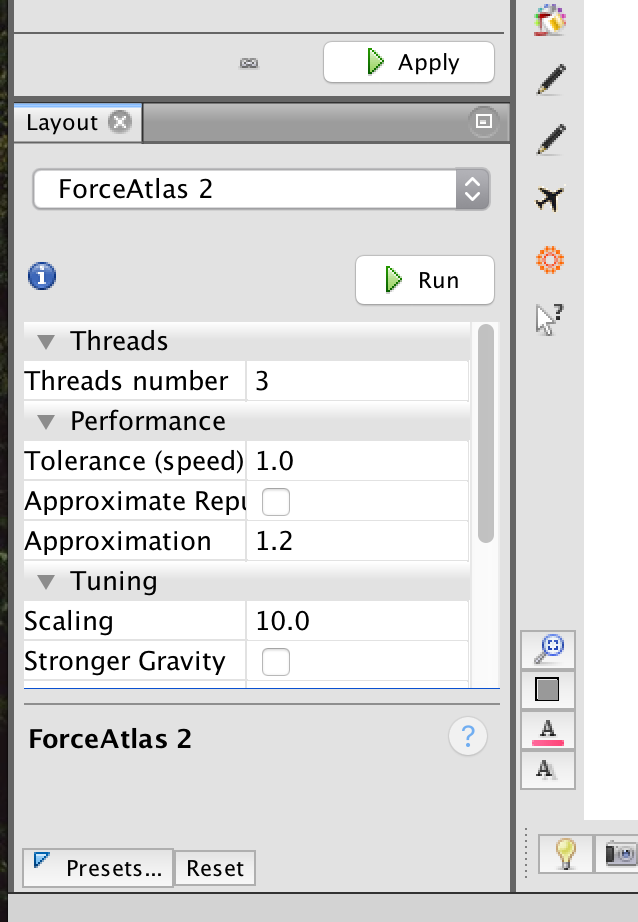
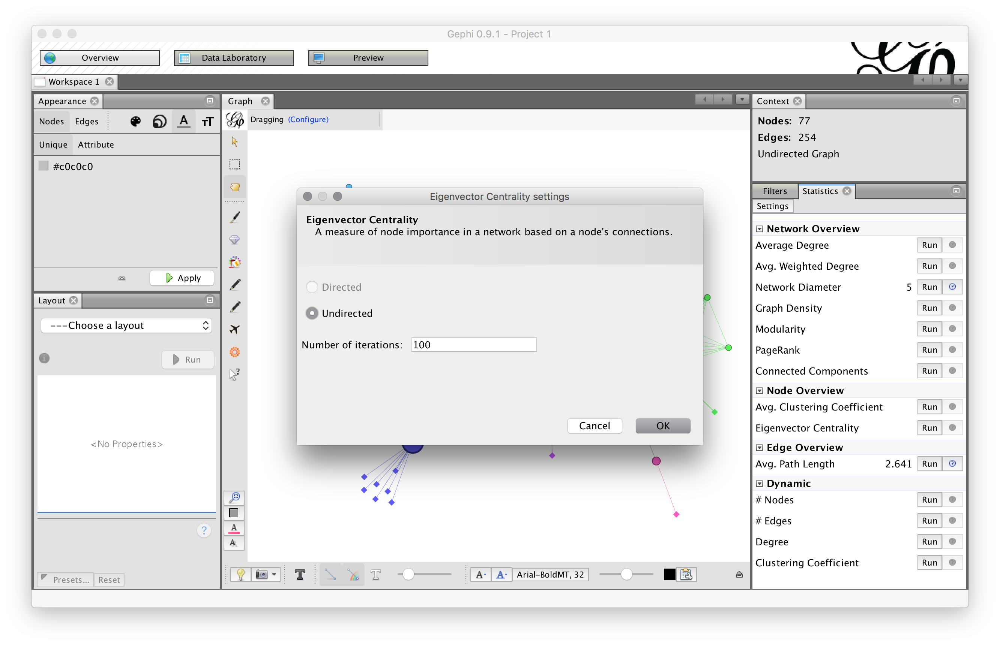
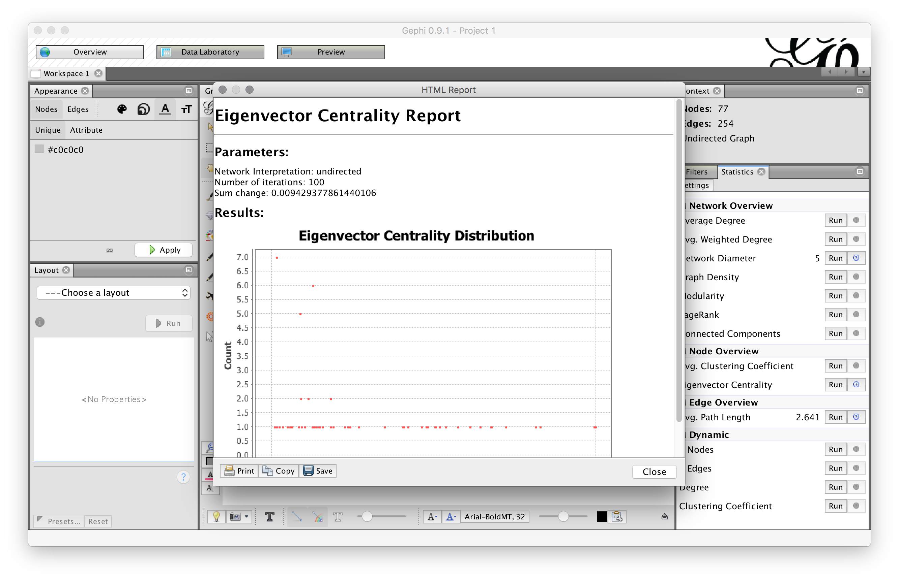
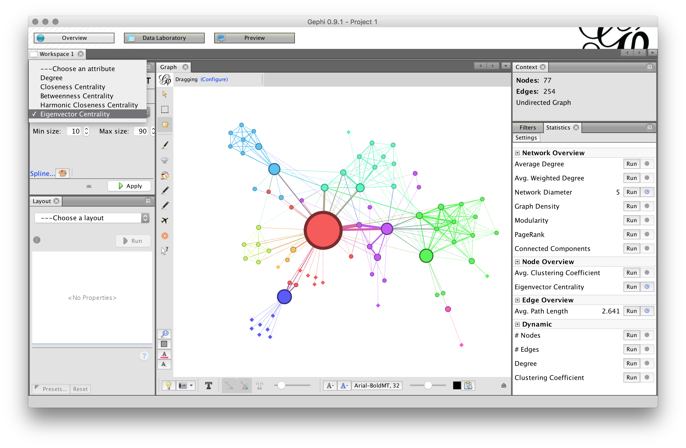
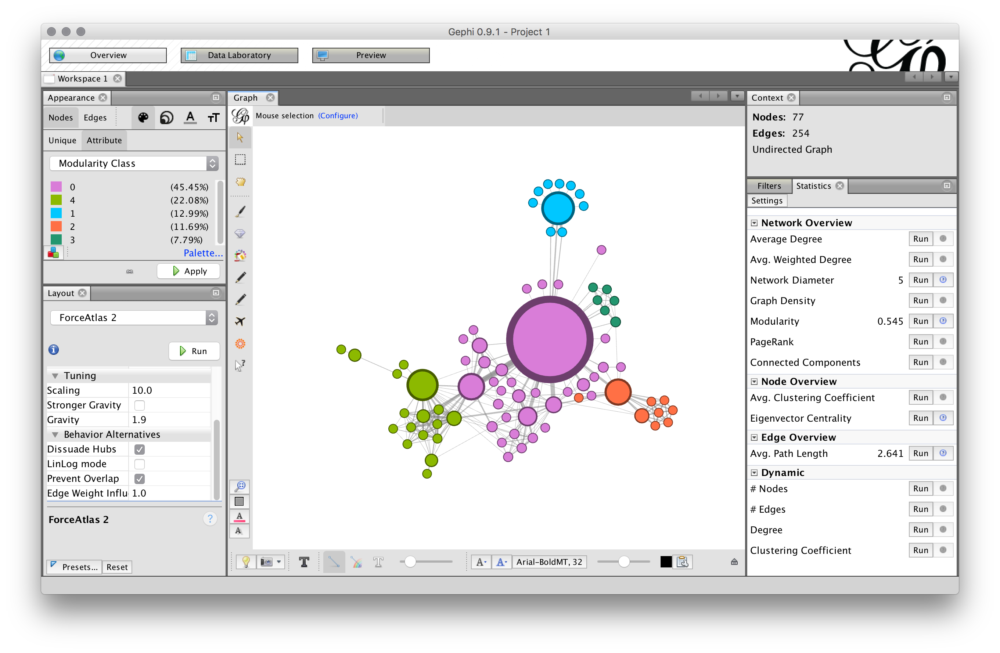
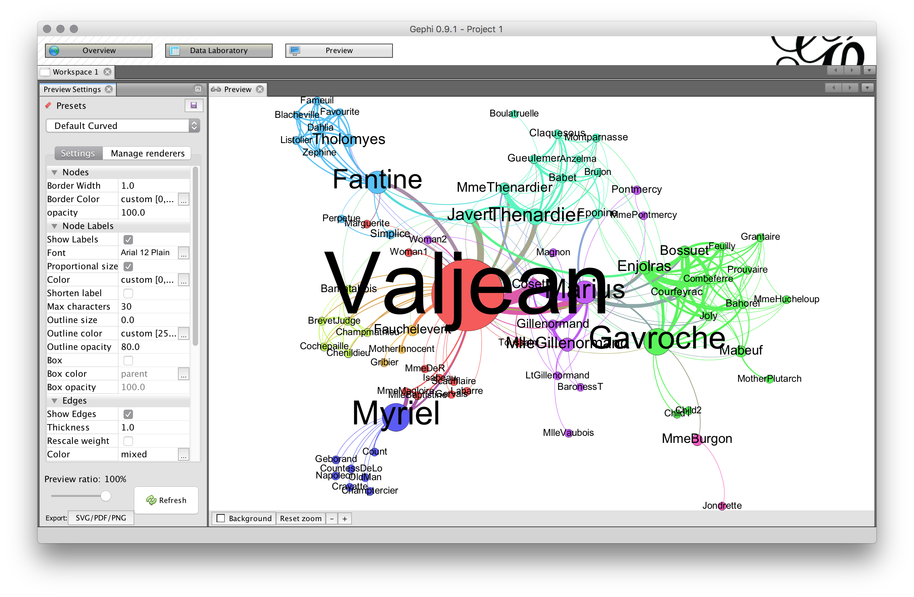

## Getting Started

Download the [latest version](https://gephi.org/) of Gephi. Gephi runs on an older version of Java, so you'll need to download and install a previous version of the language (Java 6). You'll find more information about this issue on the [Gephi forums](https://forum.gephi.org/viewforum.php?f=3) or [Gephi Facebook group](https://www.facebook.com/groups/gephi/) (if you're running into problems on a Mac, see [here](https://medium.com/coder-snorts/gephi-is-broken-on-mac-os-97fbaef4305e).)

### Plugins

We'll also need a few extra plugins to extend what we can do with Gephi: **GeoLayout**, **Maps of Countries**, **Noverlap**, and **Sigma**. You can search for these in the Plugins menu. You'll be prompted to restart Gephi after installing the plugins.

## Preparing and loading your data

We can set up a very basic network by defining a `source` / `target` relationship in an edges table. In this case, we might be interested in the relationship among people.

| source  | target  |
| ------  | ------  |
| Jason   | Robert  |
| Jason   | Andy    |
| Robert  | Andy    |
| Andy    | Josh    |
| Jason   | Doug    |
| Doug    | Rebecca |
| Rebecca | Jason   |
| Rebecca | Elaine  |
| Elaine  | Mike    |
| Leisl   | Mike    |

Table: Example edges table.

This table sets up our relationships by defining the **edges** in our network. The nodes are generated automatically based on the label of the source and/or target. If we plotted this network, we would end up with something like the below graph.

```{r, message=FALSE, error=FALSE, echo=FALSE, warning=FALSE}
library(igraph)
library(dplyr)
sample_data <- data_frame(source = c("Jason", "Jason", "Robert", "Andy", "Jason", "Doug", "Rebecca", "Rebecca", "Elaine", "Leisl"), 
                          target = c("Robert", "Andy", "Andy", "Josh", "Doug", "Rebecca", "Jason", "Elaine", "Mike", "Mike"))
sample_graph <- graph.data.frame(sample_data, directed = FALSE)
plot(sample_graph)
```

Let's take a look at the *Les Miserables* sample data in Gephi.



Open Gephi and select the `Les Miserables.gexf` sample. Once the data is loaded, click the "Data Laboratory" tab on the top of the window to examine the data behind this network. There are two possible views. The first is the "Nodes" tab that lets us see the nodes of the data, in this case set up with an `id`, `label`, and `modularity class`. 



Our edges table defines the `source` and `target` relationship for our nodes based on the node's `id`. The edges table also defines whether an edge is directed or undirected, and may include some statistics (in this case, `weight`).



## Let's make a network

Click on the "Overview" tab along the top of the window to see the network (yours may look different from the below). 



Generally when you open your data in Gephi, you will see something like the above. We want to give this network something more meaningful for us to look at, so we'll do a few things to change the layout and include some network statistics to examine various aspects of the network. Let's start by adjusting the layout. In the lower left corner you'll see the "Layout" pane. From the dropdown, select `Force Atlas 2` and click "Run." You can adjust various aspects of the layout algorithm, including the strength of the gravity, preventing node overlap, dissuading hubs, and so on. Play around with these options until you have the layout you like, then click "Stop."



Now that our layout has given us something a little easier to look at, let's do some network statistics. Let's say we want to know which node in this character interaction network is the most important. Thinking back on our [network literacy](network-literacy.html), one measure might be centrality. Let's use Gephi's [Eigenvector centrality](https://en.wikipedia.org/wiki/Centrality) measure to find important nodes. Along the righthand side, you'll find the network algorithms for analyzing the relationships. Click "Run" next to Eigenvector Centrality to start the analysis.



Once the analysis runs, we'll be presented with a graph of the centrality distribution. You may or may not want to include this information in a publication for explaining your methodology.



Once the statistics are available, we can now apply the measures to various visual aspects of the graph. Since Eigenvector is a measure of node importance, let's use the results to change the size of the nodes based on their centrality. In the "Appearance" pane in the upperlefthand side, select the "Size" tab (the three circle icon), select "Attribute", and from the dropdown choose "Eigenvector Centrality." Feel free to adjust the minimum and maximum size of the circles. Otherwise, select "Apply" and our nodes will resize based on their Eigenvector measure.



We can now see the more important nodes in the network based on their centrality. We can also do additional statistical measures such as `modularity` to find communities in the network. In the "Statistics" pane run "Modularity". Once the measures are available, let's color the nodes based on their communities. In the "Appearance" pane, select "Nodes," select the "Color" tab (the painting palette), select "Attributes" and choose "Modularity Class" from the dropdown. You can change the color palette if you choose. Then "Apply" the changes to see the measure applied to the nodes.



When your happy with your network, you can select the "Preview" pane in the upper toolbar to create a visually-pleasing output that can be saved as an SVG, PDF, or PNG. You can adjust node labels, edge sizes and appearance, and other features of the network. Select "Refresh" to see the changes.



## Next steps

Individually or in groups, create your own network visualization.

1.  Select another sample dataset from Gephi, [download one of their samples](https://github.com/gephi/gephi/wiki/Datasets), or load in your own network data.
2. Try running some of the network statistics on the network. Select a few different ones, examine what they're doing to the network data and what the results are inferring. What do these various measures tell you about your network?
3.  Once you have some network measures ready, try adjusting the visuals in the network---node size and color, edge colors and weights, layouts, and so on. 
4.  Output your network as a PDF or PNG. We'll come back together, time permitting, to talk about your results.
5.  Examine some of the [plugins for Gephi](https://marketplace.gephi.org/plugins/). You can, for example, embed latitude and longitude data for nodes and [geographically layout the network](https://marketplace.gephi.org/plugin/geolayout/). There are [many possible layout options](https://marketplace.gephi.org/plugin_categories/plugin-layout/). 
