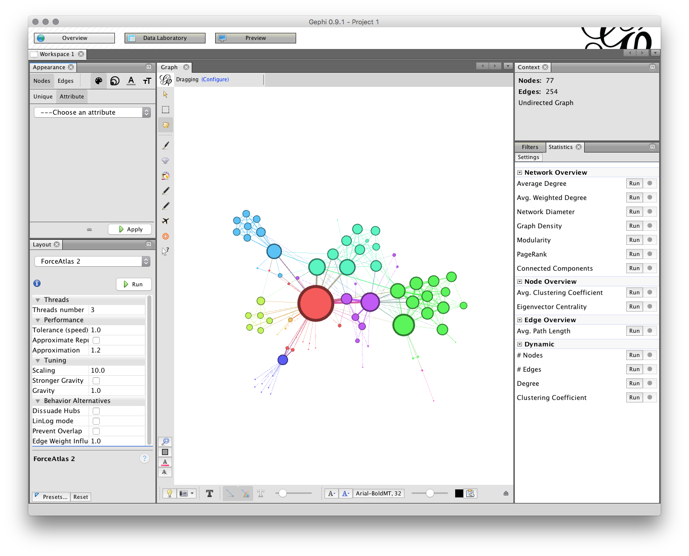
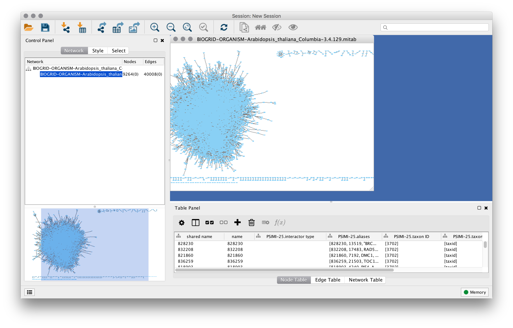
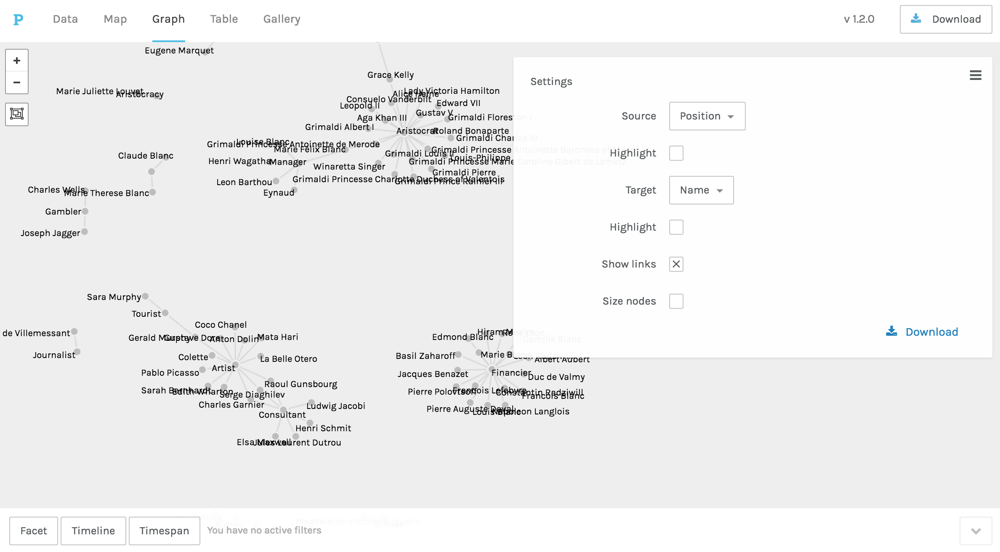

## Networks and digital history

[Digital humanities](http://whatisdigitalhumanities.com/) offers a wide variety of methodological and pedagogical approaches, including text and data mining, network analysis, and spatial analysis. 

Among the more powerful desktop applications for network analysis such as Gephi, these software provide algorithms for interpreting networks and relationships as well as creating visualizations. Web approaches, to date, have not come with the computational power of desktop applications, but allow the easier creation of network visualizations. Networks also tend to be tricker to comprehend over maps, which entails a more intense methodological borrowing than we do with maps. That includes using algorithms designed by computer scientists for purposes that [might be at odds](https://tedunderwood.com/2011/10/16/lsa-is-a-marvellous-tool-but-humanists-may-no-use-it-the-way-computer-scientists-do/) of the humanities scholar. As Scott Weingart [once warned](http://www.scottbot.net/HIAL/index.html@p=6279.html), "Networks *can* be used on any project. Networks *should* be used on far fewer."

The aim of this workshop is to help introduce you to some of these approaches for making and using networks.

## How this workshop will proceed

Our time together is limited and we cannot go too deeply into working with, obtaining, or preparing network data. My hope is to introduce you to the basics, provide a set of tools to demonstrate what is possible, and continue the conversation beyond this workshop. 

Be aware, also, that far more time will be spent preparing and cleaning data than creating the visualizations themselves. [Some  argue](http://www.nytimes.com/2014/08/18/technology/for-big-data-scientists-hurdle-to-insights-is-janitor-work.html?_r=0) that you'll spend as much as 80% of your time preparing your data for  visualization, while the remainder 20% goes to the work of visualization itself. Since we're together for a limited time, we won't have a chance to really experience the tedious, frustrating, and arduous work that can go into preparing network data. These are approaches that you will need to develop for your research, and skills that you will bring to your students. As you take these skills to the classroom, consider the kinds of things your students can complete and receive the most reward for effort.

That said, networks---through desktop software and web-based platforms---have made the tools of these visualizations easier for scholars and students to grapple with. Maps are often more readily understood than networks---because we frequently use maps as part of our day to day lives, their use for research and narrative is more apparent than networks which comes with an entire set of vocabulary, methods, theory, and approaches. The interactivity of maps allows scholars to filter data, to operate at different spatial scales, and embed sources into maps. Similarly, networks can move from large-scale relationships to explorations of smaller connections. These techniques, however, take time. Once you've begun to master them, consider how to bring these approaches and skills into your classroom and your research.

As noted above, the biggest challenge with creating networks is the data---namely, once the data is ready and you've gained some competendnce in making these visualizations, the process proceeds quickly. Far more of your time---and your student's time---will be spent in preparing data, a task that's highly variable to the visualization and evidence you are working with. In other words, the evidence you're attempting to visualize comes with the very thing humanities scholars spend their time on---the finding and interpretation of evidence. 

```{r echo=FALSE, fig.height=2}
library(DiagrammeR)
grViz(width = "100%", diagram = "
      digraph nicegraph {
      graph [overlap = true,
             rankdir = LR,
             label = <The Process of Visualization<br/><br/>>,
             fontname = Lato,
             labelloc = 't'
]

      node [shape = box,
           overlap = true,
           fontname = Lato,
           fontsize = 10]
      A [label = 'Find or create data']
      B [label = 'Clean/tidy data']
      C [label = 'Explore and \n transform the data']
      D [label = 'Visualize']
      E [label = 'Interpret']
      F [label = 'Communicate']

      A->B->C->D->E->F [splines = 'line']
      E->C [splines = 'curved']
      C->A [splines = 'curved']
      }
      ")
```

*(Figure adapted from [Lincoln Mullen.](http://lincolnmullen.com/projects/spatial-workshop/introduction.html))*

## The network toolbox

### Gephi

[Gephi](https://gephi.org/) is an open-source network analysis and visualization platform developed by the University of Technology of Compiégne in France. Gephi is currently the most popular software package for creating network graphs, combining both various algorithmic approaches to analyzing networks with the visualization of the network itself.

Note that we may run into some problems with Gephi. It has a [notorious problem with Java](https://medium.com/coder-snorts/gephi-is-broken-on-mac-os-97fbaef4305e#.cogwsls13), and although the new version [claims to be more stable](https://github.com/gephi/gephi/wiki/Releases), many have reported that isn't the case (myself included.)



### Cytoscape

[Cytoscape](http://www.cytoscape.org/) is an open-source software platform designed originally for scientists, largely used in biological research, but can graph any network of nodes and edges. Like Gephi, it has an ecosystem of plugins developed by others in the community that provide various alternative ways of visualizing networks in the platform. 



### Palladio

[Palladio](http://hdlab.stanford.edu/palladio/), developed by the [Humanities+Design](http://hdlab.stanford.edu/) lab at Stanford University, is designed for the easy visualization of humanities data as a map, graph, table, or gallery. Palladio's network visualization capabilities allow for the visualization of a bivariate graph based on any two dimensions inside a dataset, that can then be filtered based on attributes in the data. 



## Programming languages

The most powerful method for creating networks come from programming languages such as [R](http://www.r-project.org/), [Python](https://www.python.org/), and [Javascript](http://www.w3schools.com/js/). These languages allow you to control various algorithmic and aesthetic aspects of network visualizations. These include powerful libraries such as [igraph]() and [sne](). We won't be digging into any languages during this workshop, but there are many resources available for getting started with programmatic approaches to visualization. See the [resources page](resources.html) for more.

## Before this workshop

There are a few things to install for the workshop:

-   [Gephi](https://gephi.org/). A common platform for building network visualizations.
-   A plain text editor. For Mac I recommend [TextWrangler](http://www.barebones.com/products/textwrangler/). Please do not use TextEdit. For Windows,  [Notepad++](https://notepad-plus-plus.org/).
-   A program for editing [comma-separated values (CSV)](https://en.wikipedia.org/wiki/Comma-separated_values) files. Microsoft Excel does things to data that should never be done to data, so I recommend [Libre Office](https://www.libreoffice.org/) as a more reliable alternative.

Additionally, an FTP/SFTP client for accessing websites might be useful but is optional. On Mac and Windows I recommend [Cyberduck](https://cyberduck.io/?l=en).
