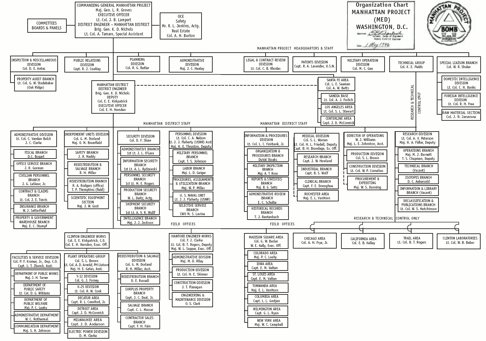

> "There is a tendency when using graphs to become smitten with one's own data. Even though a graph of a few hundred nodes quickly becomes unreadable, it is often satisfying for the creator because the resulting figure is elegant and complex and may be subjectively beautiful, and the notion that the creator's data is "complex" fits just fine with the creator's own interpretation of it. Graphs have a tendency of making a data set look sophisticated and important, without having solved the problem of enlightening the viewer." ---Ben Fry[^1]

Networks come with a particular vocabulary and methodology that digital humanists should be aware of if they're adopting the method for their research and teaching. 

## Network fundamentals

### Nodes, Edges, Attributes

Networks, also referred to as *graphs*, seek to represent the interrelationship of observations. Networks allow you to view two things: **entities** and **relationships**. We refer to entities as **nodes**, and represent the relationship between nodes with **edges** (or **links**). 

Let's consider a basic set of nodes. Nodes can represent anything, from people to places to themes and concepts. 

```{r, message=FALSE, warning=FALSE, echo=FALSE}
library(network)
library(sna)
library(ggplot2)
library(geomnet)
library(historydata)
data(tudors)

ggplot(tudors, aes(from_id = person_2, to_id = person_1)) +
  geom_net(aes(label = person_2), linewidth = 0.5,
           size = 6, ecolour = "white") +
  theme_net()
```

Edges connect these nodes, representing a relationship. They might connect citations among scholarly works, siblings, or archival objects. Network representations almost always represent edges only between two nodes.

```{r, message=FALSE, warning=FALSE, echo=FALSE}
ggplot(data = tudors, aes(from_id = person_2, to_id = person_1)) +
  geom_net(aes(label = person_2), linewidth = 1,
           size = 6, ecolour = "grey") +
  theme_net()
```

Nodes and edges can also be given **attributes** to allow for descriptive and statistical measure of the nodes. For example, you might calculate the importance of a node to a network and assign a value to that node, resizing the circle to indicate a node's importance. Or if nodes represent places and edges travel among places, nodes might be sized by the population of a place or sized based on the number of travelers passing through a place. In our Tudor network, we can change the color of our edges to represent the type of relationship (child or spouse).

```{r, message=FALSE, warning=FALSE, echo=FALSE}
ggplot(data = tudors, aes(from_id = person_2, to_id = person_1)) +
  geom_net(aes(label = person_2), linewidth = 1, size = 6, 
           ecolour = ifelse(tudors$relationship == "child", "#a6cee3", "#b2df8a")) +
  theme_net()
```

Edges can also take on what are called **weights**, a numeric value indicating the strength of a connection between two nodes. Usually the greater the weight, the stronger the two nodes are attached. We can use these weights to visually indicate the strength of connections. If we look at a network of *Les Miserables* character interactions, for example, we can weight the edges based on the number of interactions they have.

```{r, message = FALSE, warning=FALSE, echo=FALSE}
data("lesmis")
lesmisnet <- merge(lesmis$edges, lesmis$vertices, by.x="from", by.y="label", all=TRUE)
lemisnetwork <- ggplot(data=lesmisnet, aes(from_id=from, to_id=to))
lemisnetwork + geom_net(layout.alg = "fruchtermanreingold", vjust=-0.5, size = 1.4, aes(label = from, linewidth = degree/5)) + theme_net()
```

### Directed vs undirected

Often when you're building networks, you'll come across the attribute of "directed" or "undirected" for edges. A **directed edge** is one that is part of an asymmetrical relationship, often represented by an arrow pointing to one or two nodes that share an edge. We could think of a Twitter network, where I may follow someone on Twitter but they may not follow me. Since that's an asymmetrical relationship, we would refer to this as a **directed network**. Similarly, networks described as **undirected** are generally symmetrical. Facebook, for example, tends to be a symmetrical network---in order to follow someone, you must be friends with them. 

Note that the distinction of undirected and directed networks can have significant consequences to analysis. Directionality of edges can dramatiacally change a network structure, so algorithms designed for undirected networks will produce unlikely results. Be careful with the algorithms you use and the networks you create.

### Bipartite & k-partite

Most basic networks can only support one kind of node type---think of connections among co-authors on a book. This network would not, however, connect both books and authors in the same network. Network theory assumes that nodes in a network are of the same type, thus limiting the kinds of analysis one can do with a network. Furthermore, network scientists have not yet created many algorithms for dealing with **multimodal networks**. We're limited by theory and practice.

We can, however, take advantage of what is called a **bipartite network**, an especially useful concept for humanities data. These bimodal networks support two node types, but note that edges in these kind of networks **must only allow edges beteween types, not edges within types**. That means we can draw a connection between book authors and the books they've authored.

If generalized far enough, a network can be a **multimodal** or ***k*-partite** network. These networks represent various types of nodes that can feature only links between similar types. But, again, we're limited in the number of algorithms we can use for analysing *k*-partite networks. You will need to control the complexity of your network data to meaningfully extract information or run it through network software packages.

## A few metrics

### Centrality

Humanities scholars are often interested in the importance of particular nodes to a network, such as intellectuals whose ideas are important to a Republic of Letters or cities that are frequently traveled through. The network metric used for analysing this phenomenon is called **centrality** (when edge directionality is not relevant) or **prestige** (when edge directionality is relevant). One measure of centrality called **degree centrality** which measures the number of edges connected to a node. The greater the number of connections, the greater the centrality. This measure is usually a good indicator of how many neighbors a node has, but as networks scale in size the measure begins to lose its meaningfulness. 

Network scientists have created more complex measures of centrality including **betweenness centrality** and **closeness centrality**. These measures not only look at the local centrality of a node but contextualizes that measure with the rest of the network. For example, assume a network of roads and cities. A city with the highest betweenness measure, for example, would represent the shortest path between all node pairs in the network. 

### PageRank

Developed by Google to improve it's search results, PageRank gives high scores to popular pages as a measure of **prestige**. Thus, PageRank attempts to measure the centrality of a node by taking into account the edges coming into or leading away from it. PageRank attempts to take into account not only the number of links a node receives, but also the propensity of the links to the node as well as the centrality of nodes linking to it. Scholars using PageRank would likely find themselves unsurprised by the results. If you applied PageRank to a corpus of letters, it would likely point to figures well-known in history, for example.

### Density

Density provides a global look at the network by dividing the number of edges by the potential of all edges a network could have. An very dense network, however, is not analytically rich since common connections among nodes reveals little about the structure of a network. The density measure of my neighborhood in San Jose, for example, would have a very high measure since it's likely we all know each other. But the density measure between my neighborhood and a large city, say Fresno or Sacramento, likely dwindles considerably since my neighbors know far fewer people in these places. For analysis, if you're seeing an increase in density measure over time, you might be seeing something like the creation of a new community. 

### Community Detection

Community detection allows you to look for subgraphs inside graphs. Gephi calls this **modularity**, while programming libraries like [igraph](http://cran.rstudio.org/web/packages/igraph/) provide a variety of algorithms including **edge betweenness**, **walktrap**, and **fastgreedy**. Note that these algorithms all measure community a bit differently, some by grouping nodes others by grouping edges, some by hierarchical nested communities, some by community overlap. Be aware of what the algorithms are doing with your data. Community detection assigns a community to each node in a network to analyze how closely connected nodes are internally to a network.

## Network types

### Trees and hierarchies



### Network matrices and adjacency matrices

.](img/adjmatrix_comm.png)

### Sankey diagrams

.](img/sankey.png)

## Reading networks

Break into groups and become familiar with a variety of networks below:

- Micki Kaufman, ["Everything on Paper Will Be Used Against Me": Quantifying Kissinger](http://blog.quantifyingkissinger.com/)
- [Mapping the Republic of Letters](http://republicofletters.stanford.edu/)
- [Viral Texts: Mapping Networks of Reprinting in 19th-Century Newspapers and Magazines](http://viraltexts.org/)
- Rebecca Wingo, "[Homestead Nebraska](http://homestead.unl.edu/projects/homesteading-the-plains/)"
- Brian Sarnacki, "[The Corrupt Network](http://www.briansarnacki.com/the_corrupt_network/)"
- [ORBIS](http://orbis.stanford.edu/)
- Andy Wilson, [Mapping the Revolution](https://andrewwilson84.wordpress.com/2016/03/07/mapping-the-revolution/)
- [O San Can You See: Early Washington D.C. Law & Family](http://earlywashingtondc.org/)
- [Network of Thrones](https://www.macalester.edu/~abeverid/thrones.html)
- [Kindred Britain](http://kindred.stanford.edu/)

In your groups, try and answer these questions for each project you look at:

- What networks stood out to you and why? 
- Which networks would be good examples to show students? Why so?
- Which networks were the worst? What made them the worst? 
- How do these networks drive interpretation? How do they carry narrative weight? 
- What's the audience for these networks? How effective is their interface?

[^1]:  Ben Fry, *Visualizing Data: Exploring and Explaining Data with the Processing Environment* (Sebastopol, CA: O'Reilly Media, 2007).
