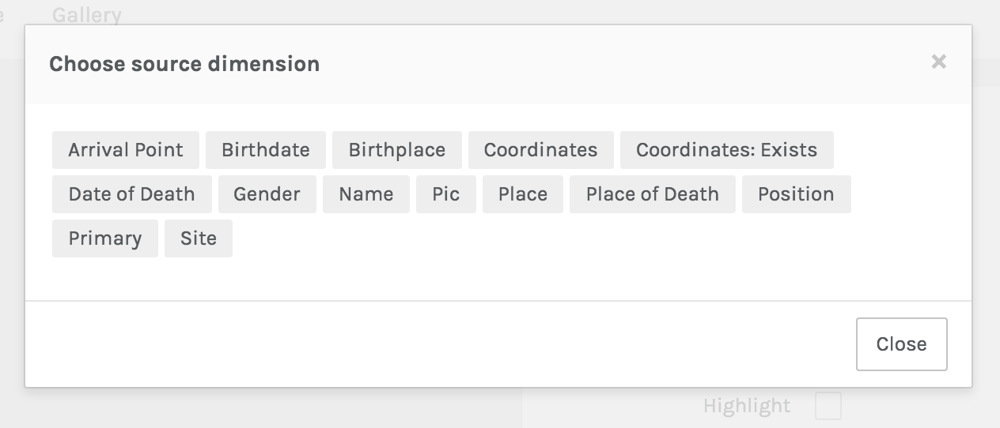
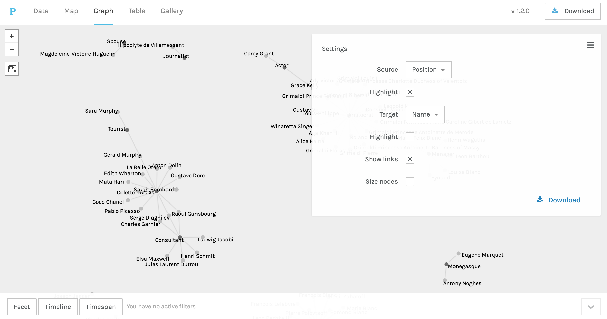
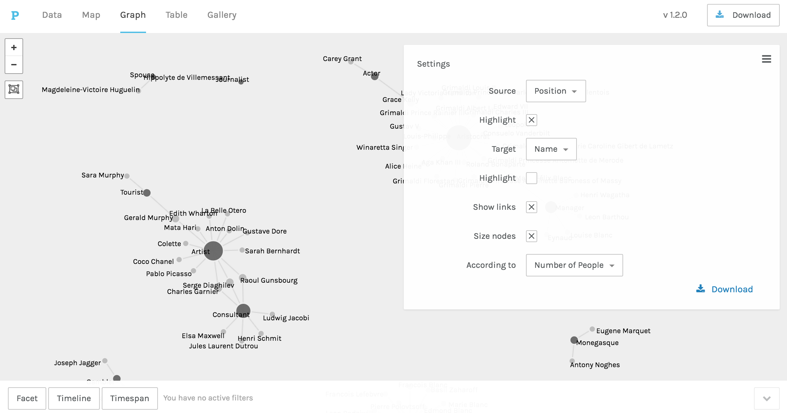
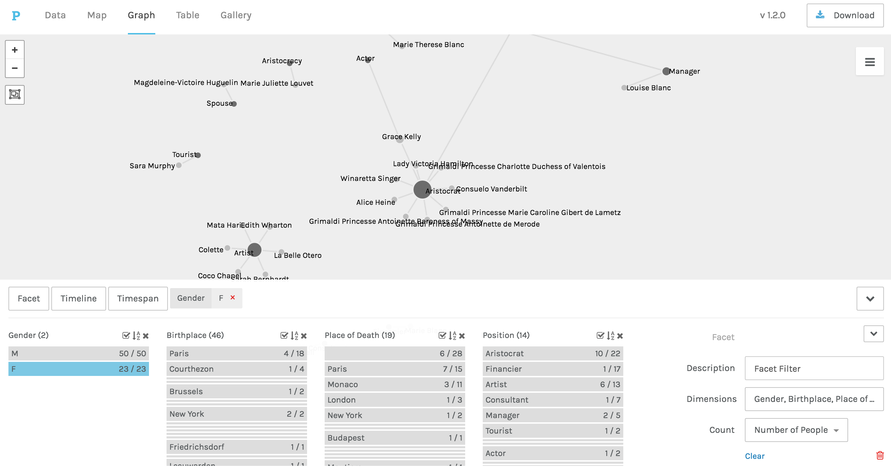
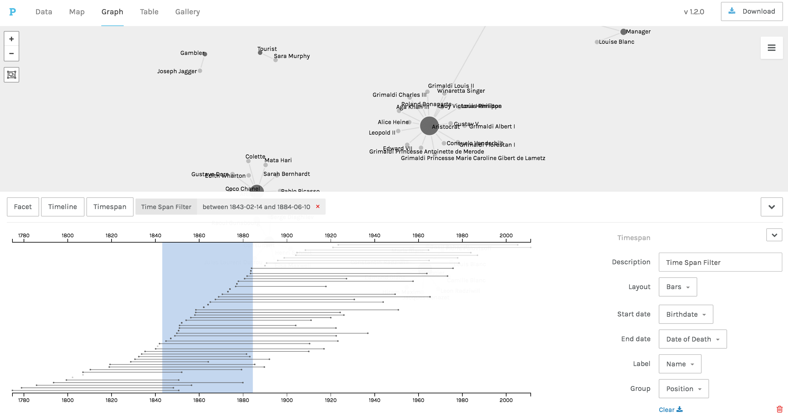

## Palladio 

Palladio is an [NEH Implementation grant](http://www.neh.gov/divisions/odh/grant-news/announcing-6-digital-humanities-implementation-grant-awards-july-2013) funded project developed by [Humanities+Design](http://hdlab.stanford.edu/) that seeks to design graphical interfaces for humanistic inquiry. Palladio is the result of realizing that humanities scholars needed to play a role in designing tools for research. The platform offers various ways to visualize data, including maps, networks, tables, and galleries. Among the more powerful features includes the ability to filter the data based on facets, allowing you to visualize your data based on different criteria or at different points in time.

### Preparing and loading your data

The easiest way to get data into Palladio is to export a [CSV](https://en.wikipedia.org/wiki/Comma-separated_values) of a spreadsheet.  CSV's can be copied and pasted into the input pane, or drag the file onto the pane for Palladio to import.

Once youve loaded the data into Palladio, it will show you the dimensions of your data as well as flag any potential issues with your data. These flags may include special characters that appear in text (like hyphens or commas), potential problems with coordinates, or issues with dates.

You can select a particular dimension to reveal the data.

Once you've reviewed your data, you may want to download the Palladio project for future use. Palladio projects are not persistent, so you will need to keep a copy of the work you've done so you can load up the visualizations and data at any time.

### Let's make a network

Palladio makes it easy to create bivariate network graphs to illustrate relationships between two dimensions. By default, Palladio creates a force-directed layout. Palladio, however, is currently limited to this layout. The platform has no way of doing computational or algorithmic analysis of your graphs; you will need a more powerful program like Gephi or igraph to do that work.

Any dimension of the data can be used as the source and target of a graph.

For this data, if we graph the "position" of each "name," we get a graph like the one below.

We can also size the nodes based on the number of connections.

You can also choose to drag points of the network to different areas of your screen to lay out the network that might be more meaningful to you.

Palladio comes with a powerful tool called facet filters, which allow you to change your data on the fly and create new visualizations. If we want to examine this network but only see females, we can select "female" from our "Gender" dimension and change how the network looks.

We can also apply timelines or timespans to view changes over time.

## Programming Languages

The most powerful method for creating networks come from programming languages such as R, Python, and Javascript. These languages allow you to control various algorithmic and aesthetic aspects of network visualizations. These include powerful libraries such as `igraph` and `sne`. We won't be digging into any languages during this workshop, but there are many resources available for getting started with programmatic approaches to visualization. See the [resources page](resources.html) for more.

## Next steps

Working individually or in groups, play around with Palladio and get a feel for how it ingests data, the types of data review you can do, and the sorts of visualizations you can create. Feel free to use your own data, or the sample data provided by Palladio. Create a few different visualizations. How does the facet filtering help you see different things in the data? What visualizations work best for the data you're working with? What limitations do you run into with Palladio?

